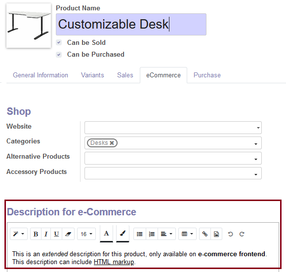
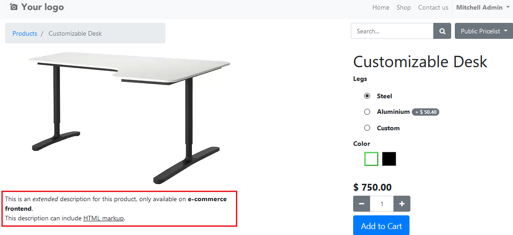

Once installed, website description is editable from product form:

Then, this description will be shown within the e-Commerce product page, as a
contained block placed right above the standard "website description" block:

It is independent from the two native Odoo fields, so all of them can be used
together on the same product page:

| Field                    | Where it renders                                  |
|--------------------------|---------------------------------------------------|
| `description_ecommerce`  | Under the product name, next to the price         |
| `public_description`     | This module: contained block, full page width     |
| `website_description`    | `#product_full_description`, bottom of the page   |

To place the description *below* the standard one instead, change
`position="before"` to `position="after"` in
`views/website_sale_template.xml`.

To allow editing it inline from the website editor instead of only from the
product form, drop the `o_not_editable` class from the same template.
